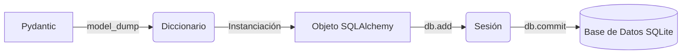

## Agenda

```{=html}
<div class="split3" style="margin-top: 1em;">
  <div class="card fade-up d1">
    <div class="c-icon">🗂️</div>
    <div class="c-title">Módulo 1: Conceptos Base</div>
    <div class="c-desc" style="margin-top: 0.5em; font-size: 0.75em; line-height: 1.4;">
      • Protocolo HTTP y HTTPS<br>
      • URLs, JSON y verbos CRUD<br>
      • Hola Mundo con FastAPI<br>
      • Path y Query parameters<br>
      • Validación con Type Hints
    </div>
  </div>
  <div class="card card-blue fade-up d2">
    <div class="c-icon">🏠</div>
    <div class="c-title" style="color: var(--blue);">Módulo 2: Datos en TXT</div>
    <div class="c-desc" style="margin-top: 0.5em; font-size: 0.75em; line-height: 1.4;">
      • Lectura y parseo de <code>casas.txt</code><br>
      • Endpoints con filtros dinámicos<br>
      • Manejo de errores con HTTPException<br>
      • Modelos Pydantic (BaseModel)<br>
      • Refactorización y metadatos
    </div>
  </div>
  <div class="card card-green fade-up d3">
    <div class="c-icon">🗄️</div>
    <div class="c-title" style="color: var(--green);">Módulo 3: SQLite Real</div>
    <div class="c-desc" style="margin-top: 0.5em; font-size: 0.75em; line-height: 1.4;">
      • SQL básico e integración con Python<br>
      • Placeholders y prevención de SQLi<br>
      • Consulta dinámica (WHERE 1=1)<br>
      • Agregaciones y estadísticas en SQL<br>
      • Consumo con JS y Python
    </div>
  </div>
</div>
```

---

::: {style="text-align:center;padding:2.5em 0;"}

::: {.r-fit-text}
De cero a tu primera API 🚀
:::

**Módulo 1 · 2 horas**

*Hoy vas a crear algo que el mundo entero puede usar.*

:::

---

## ¿Qué vas a aprender hoy?

**Objetivos del módulo 1:**

```{=html}
<div style="margin-top: 0.5em; max-width: 800px; margin-left: auto; margin-right: auto;">
  <div class="flow-steps" style="gap: 0.8em;">
    <div class="fs-step fade-up d1"><div class="fs-num">💡</div><div class="fs-text"><strong>Concepto base</strong>: Entender qué es una API y para qué sirve en la vida real.</div></div>
    <div class="fs-step fade-up d2"><div class="fs-num">🔄</div><div class="fs-text"><strong>El Protocolo</strong>: Conocer cómo funciona HTTP (peticiones y respuestas).</div></div>
    <div class="fs-step fade-up d3"><div class="fs-num">⚡</div><div class="fs-text"><strong>Primeros pasos</strong>: Instalar FastAPI y crear tu primer "Hola mundo" en producción.</div></div>
    <div class="fs-step fade-up d4"><div class="fs-num">📝</div><div class="fs-text"><strong>Formato estándar</strong>: Entender qué es JSON y por qué lo usamos como lenguaje universal.</div></div>
  </div>
</div>
```

---

## ¿Qué es una API? — Analogía 🍽️

```{=html}
<div class="split2" style="margin-top: 1em;">
  <div class="card card-blue fade-up d1">
    <div class="c-title" style="color:var(--blue);">El Restaurante</div>
    <div class="c-desc" style="margin-top: 0.5em; font-size: 0.78em; line-height: 1.5;">
      • <strong>Tú (Cliente)</strong>: Eliges y pides la comida.<br>
      • <strong>El Mesero (API)</strong>: Toma tu orden, la lleva a la cocina y trae el plato de vuelta.<br>
      • <strong>La Cocina (Servidor)</strong>: Procesa tu pedido y prepara el plato.
    </div>
  </div>
  <div class="box-teal fade-up d2" style="font-size: 0.82em; line-height: 1.6;">
    <div style="font-size: 1.15em; margin-bottom: 0.4em;">💡 <strong>Definición</strong></div>
    Una <strong>API</strong> (Application Programming Interface) es el intermediario o "mesero" que conecta tu aplicación (el cliente) con los datos y servicios que están en el servidor.
  </div>
</div>
```

---

## ¿Para qué sirve una API en la vida real?

```{=html}
<div class="split3" style="margin-top: 1em;">
  <div class="card pop d1">
    <div class="c-icon">🚗</div>
    <div class="c-title">Uber & Maps</div>
    <div class="c-desc" style="margin-top: 0.5em; font-size: 0.74em; line-height: 1.45;">Uber no dibuja los mapas ni calcula rutas desde cero; le pide la información a la <strong>API de Google Maps</strong>.</div>
  </div>
  <div class="card card-blue pop d2">
    <div class="c-icon">💳</div>
    <div class="c-title" style="color: var(--blue);">PayPal & Tiendas</div>
    <div class="c-desc" style="margin-top: 0.5em; font-size: 0.74em; line-height: 1.45;">Una tienda de ropa no gestiona cuentas de banco; le pide a la <strong>API de PayPal</strong> que procese el cobro de forma segura.</div>
  </div>
  <div class="card card-green pop d3">
    <div class="c-icon">⛅</div>
    <div class="c-title" style="color: var(--green);">App del Clima</div>
    <div class="c-desc" style="margin-top: 0.5em; font-size: 0.74em; line-height: 1.45;">La app de tu móvil no tiene sensores globales; consulta la <strong>API de un servidor meteorológico</strong> para mostrar el clima.</div>
  </div>
</div>
```

::: {.fragment .fade-up}
```{=html}
<div class="box-teal" style="margin-top: 0.8em; text-align: center; font-size: 0.84em;">
  💡 <strong>Conclusión:</strong> Las APIs conectan aplicaciones entre sí para reutilizar funcionalidades sin reinventar la rueda.
</div>
```
:::

---

## API REST: El tipo más común

REST = Representational State Transfer

```{=html}
<div style="max-width: 800px; margin: 0.5em auto;">
  <div class="flow-steps" style="gap: 0.8em;">
    <div class="fs-step fade-up d1">
      <div class="fs-num">📐</div>
      <div class="fs-text"><strong>Estilo de diseño:</strong> No es un protocolo rígido, sino un conjunto de reglas arquitectónicas estándar.</div>
    </div>
    <div class="fs-step fade-up d2">
      <div class="fs-num">🌐</div>
      <div class="fs-text"><strong>Usa HTTP:</strong> Se monta sobre el mismo protocolo web que utilizas para navegar en internet.</div>
    </div>
    <div class="fs-step fade-up d3">
      <div class="fs-num">📝</div>
      <div class="fs-text"><strong>Formato JSON:</strong> La información viaja en un estándar ligero, estructurado y fácil de leer.</div>
    </div>
    <div class="fs-step fade-up d4">
      <div class="fs-num">🔗</div>
      <div class="fs-text"><strong>Orientado a Recursos:</strong> Cada URL representa un "recurso" específico (ej: una casa, un usuario, un producto).</div>
    </div>
  </div>
</div>
```

---

## ¿Qué es HTTP? — El protocolo base

HTTP = HyperText Transfer Protocol

```{=html}
<div style="margin-top: 0.5em; max-width: 1000px; margin-left: auto; margin-right: auto;">
  <div class="box-teal fade-up d1" style="font-size: 0.8em; text-align: center; margin-bottom: 0.8em;">
    Es el lenguaje estándar que usan los navegadores, aplicaciones y servidores para hablar entre sí.
  </div>

  <!-- Escena de red de ida y vuelta -->
  <div style="position:relative;width:100%;height:140px;margin:.3em 0;">
    <div style="position:absolute;top:50%;left:15%;width:70%;height:3px;background:var(--border);transform:translateY(-50%);"></div>
    
    <div class="node-box node-client pulse-blue" style="position:absolute;left:0;top:50%;transform:translateY(-50%);padding:.4em .8em;">💻<br>Cliente</div>
    <div class="node-box node-server pulse-teal" style="position:absolute;right:0;top:50%;transform:translateY(-50%);padding:.4em .8em;">🖥️<br>Servidor</div>
    
    <div class="packet pkt-req" style="top:15%;padding:.2em .6em;font-size:0.75em;">Petición HTTP ➔</div>
    <div class="packet pkt-res" style="top:75%;padding:.2em .6em;font-size:0.75em;background:var(--green);">⎋ Respuesta HTTP</div>
  </div>

  <div class="box-muted fade-up d2" style="font-size: 0.78em; text-align: center; margin-top: 0.8em;">
    Cada interacción siempre sigue este ciclo: el cliente hace una petición, el servidor responde.
  </div>
</div>
```

---

## Los métodos HTTP (verbos)

Cada petición indica qué acción queremos realizar sobre el recurso:

```{=html}
<table class="tbl" style="margin-top: 1em;">
  <thead>
    <tr>
      <th>Verbo</th>
      <th>¿Qué hace?</th>
      <th>Uso en CRUD</th>
      <th>Ejemplo en la Vida Real</th>
    </tr>
  </thead>
  <tbody>
    <tr class="fade-up d1">
      <td><span class="m-get">GET</span></td>
      <td>Obtiene o lee información.</td>
      <td><strong>R</strong>ead</td>
      <td>Ver los detalles de una casa</td>
    </tr>
    <tr class="fade-up d2">
      <td><span class="m-post">POST</span></td>
      <td>Crea un recurso nuevo.</td>
      <td><strong>C</strong>reate</td>
      <td>Registrar una casa nueva</td>
    </tr>
    <tr class="fade-up d3">
      <td><span class="m-put">PUT</span></td>
      <td>Actualiza o reemplaza un recurso.</td>
      <td><strong>U</strong>pdate</td>
      <td>Modificar el precio de una casa</td>
    </tr>
    <tr class="fade-up d4">
      <td><span class="m-del">DELETE</span></td>
      <td>Elimina un recurso.</td>
      <td><strong>D</strong>elete</td>
      <td>Borrar la casa del catálogo</td>
    </tr>
  </tbody>
</table>
```

::: {.fragment .fade-up}
```{=html}
<div class="box-yellow" style="margin-top: 0.6em; text-align: center; font-size: 0.82em;">
  💡 <strong>Nota del curso:</strong> Hoy nos enfocaremos exclusivamente en el método <strong>GET</strong>.
</div>
```
:::

---

## ¿Qué es una URL? (anatomía)

Es la dirección única que identifica un recurso en la red.

```{=html}
<div style="margin-top: 1em; max-width: 800px; margin-left: auto; margin-right: auto;">
  <div class="url-bar fade-up d1" style="text-align: center; padding: 0.8em; font-size: 0.95em;">
    <span class="u-scheme">http://</span><span class="u-host">localhost</span><span class="u-key">:8000</span><span class="u-path">/casas/3</span>
  </div>

  <div class="split2" style="margin-top: 0.8em; gap: 1em;">
    <div class="card pop d2">
      <div class="c-title" style="color:var(--teal);">Dominio y Puerto</div>
      <div class="c-desc" style="margin-top: 0.3em; font-size: 0.74em; line-height: 1.4;">
        • <strong>http://</strong> ➔ Protocolo web.<br>
        • <strong>localhost</strong> ➔ Servidor local (tu máquina).<br>
        • <strong>:8000</strong> ➔ Puerto de entrada.
      </div>
    </div>
    <div class="card card-blue pop d3">
      <div class="c-title" style="color:var(--blue);">Endpoint / Ruta</div>
      <div class="c-desc" style="margin-top: 0.3em; font-size: 0.74em; line-height: 1.4;">
        • <strong>/casas/3</strong> ➔ Identifica que quieres acceder al recurso "casa" con identificador 3 en el servidor.
      </div>
    </div>
  </div>
</div>
```

---

## ¿Qué es un endpoint?

Un endpoint es una dirección específica (ruta) dentro de tu API encargada de una tarea concreta.

```{=html}
<div class="split3" style="margin-top: 1em;">
  <div class="card pop d1">
    <div class="c-icon">📂</div>
    <div class="c-title">/casas</div>
    <div class="c-desc" style="margin-top: 0.5em; font-size: 0.75em; line-height: 1.4;">Dame la lista de todas las casas en venta.</div>
  </div>
  <div class="card card-blue pop d2">
    <div class="c-icon">🏠</div>
    <div class="c-title" style="color: var(--blue);">/casas/1</div>
    <div class="c-desc" style="margin-top: 0.5em; font-size: 0.75em; line-height: 1.4;">Dame los detalles específicos de la casa número 1.</div>
  </div>
  <div class="card card-green pop d3">
    <div class="c-icon">📊</div>
    <div class="c-title" style="color: var(--green);">/casas/precio</div>
    <div class="c-desc" style="margin-top: 0.5em; font-size: 0.75em; line-height: 1.4;">Dame una lista de casas ordenadas por precio.</div>
  </div>
</div>
```

```{=html}
<div class="box-teal fade-up d4" style="margin-top: 0.8em; text-align: center; font-size: 0.82em;">
  💡 <strong>Buena Práctica:</strong> Cada endpoint debe encargarse de UNA sola acción o recurso de forma clara.
</div>
```

---

## ¿Qué es JSON?

JSON = JavaScript Object Notation

* Es el formato estándar de la web para mandar y recibir datos.
* Consiste en texto plano estructurado en pares clave-valor (muy fácil de entender).

```json
{
  "precio": 850000,
  "habitaciones": 3,
  "baños": 2
}
```

```{=html}
<div class="box-teal fade-up d1" style="font-size: 0.8em; text-align: center;">
  Casi todos los lenguajes de programación del mundo pueden leer y generar JSON nativamente.
</div>
```

---

## JSON vs Diccionario de Python

Son extremadamente similares, pero tienen ligeras diferencias de sintaxis:

```{=html}
<div class="split2" style="margin-top: 1em;">
  <div class="box-blue fade-up d1">
    <strong>Diccionario en Python</strong>
    <pre style="font-size: 0.76em !important;"><code class="python">{
  "precio": 850000,
  "activo": True
}</code></pre>
    Utiliza mayúscula: <code>True</code> / <code>False</code> / <code>None</code>.
  </div>
  <div class="box-green fade-up d2">
    <strong>JSON (Estándar Web)</strong>
    <pre style="font-size: 0.76em !important;"><code class="json">{
  "precio": 850000,
  "activo": true
}</code></pre>
    Utiliza minúscula: <code>true</code> / <code>false</code> / <code>null</code>.
  </div>
</div>
```

```{=html}
<div class="box-teal fade-up d3" style="font-size: 0.8em; text-align: center; margin-top: 0.5em;">
  💡 <strong>¡No te preocupes!</strong> FastAPI se encarga de realizar esta conversión de tipos automáticamente.
</div>
```

---

## ¿Qué es FastAPI?

Es un framework web moderno y de muy alto rendimiento para construir APIs con Python 3.8+.

```{=html}
<div class="split2" style="margin-top: 1em; gap: 1.5em;">
  <div class="flow-steps" style="gap: 0.6em;">
    <div class="fs-step ok fade-up d1"><div class="fs-num">⚡</div><div class="fs-text"><strong>Velocidad:</strong> Rendimiento a la par de NodeJS y Go gracias a Starlette y Pydantic.</div></div>
    <div class="fs-step ok fade-up d2"><div class="fs-num">🐛</div><div class="fs-text"><strong>Seguridad:</strong> Reduce los errores de código hasta en un 40%.</div></div>
    <div class="fs-step ok fade-up d3"><div class="fs-num">📝</div><div class="fs-text"><strong>Auto-Documentado:</strong> Genera documentación interactiva Swagger sin código adicional.</div></div>
  </div>
  <div class="box-teal fade-up d4" style="font-size: 0.82em; line-height: 1.6;">
    <div style="font-size: 1.15em; margin-bottom: 0.4em;">⚙️ <strong>Estándares Abiertos</strong></div>
    FastAPI está basado 100% en los estándares abiertos de <strong>OpenAPI</strong> y <strong>JSON Schema</strong>, asegurando compatibilidad global.
  </div>
</div>
```

---

## FastAPI vs Otras Opciones

```{=html}
<table class="tbl" style="margin-top: 1em; font-size: 0.82em;">
  <thead>
    <tr>
      <th>Framework</th>
      <th>Velocidad</th>
      <th>Curva de aprendizaje</th>
      <th>Docs automáticas</th>
    </tr>
  </thead>
  <tbody>
    <tr class="fade-up d1">
      <td class="td-best"><strong>FastAPI</strong></td>
      <td class="td-best">⚡ Extrema</td>
      <td class="td-best">Baja (Fácil) 🟢</td>
      <td class="td-best">✅ Sí (Nativo)</td>
    </tr>
    <tr class="fade-up d2">
      <td><strong>Flask</strong></td>
      <td class="td-mid">Media</td>
      <td class="td-best">Baja (Fácil) 🟢</td>
      <td class="td-low">❌ No (Librería extra)</td>
    </tr>
    <tr class="fade-up d3">
      <td><strong>Django REST</strong></td>
      <td class="td-low">Baja / Media</td>
      <td class="td-low">Alta (Complejo) 🔴</td>
      <td class="td-mid">⚠️ Parcial (Configuración)</td>
    </tr>
  </tbody>
</table>
```

```{=html}
<div class="box-teal fade-up d4" style="font-size: 0.82em; text-align: center; margin-top: 0.8em;">
  FastAPI es la opción idónea en la industria actual para construir microservicios y APIs REST ágiles.
</div>
```

---

## Instalando Python y pip

Antes de comenzar, asegúrate de tener las herramientas en tu sistema:

```bash
# Verifica la versión de Python (requiere >= 3.8)
python --version

# Verifica el gestor de paquetes pip
pip --version
```

```{=html}
<div class="box-yellow fade-up d1" style="font-size: 0.82em; text-align: center;">
  Si obtienes un comando no encontrado, descarga e instala la última versión estable desde la web oficial: <a href="https://www.python.org" target="_blank">python.org</a>.
</div>
```

---

## Creando un entorno virtual

Aísla las dependencias de tu proyecto para evitar conflictos globales:

```bash
# 1. Crea la carpeta de tu nuevo proyecto y entra en ella
mkdir api-casas
cd api-casas

# 2. Crea el entorno virtual llamado 'venv'
python -m venv venv

# 3. Activa el entorno virtual (Mac/Linux)
source venv/bin/activate

# 3. Activa el entorno virtual (Windows)
venv\Scripts\activate
```

```{=html}
<div class="box-green fade-up d1" style="font-size: 0.8em; text-align: center;">
  Verás un prefijo <code>(venv)</code> al inicio de tu terminal. ¡Eso significa que está activado con éxito!
</div>
```

---

## Instalando FastAPI

Instala los paquetes necesarios dentro de tu entorno virtual:

```bash
pip install "fastapi[standard]"
```

```{=html}
<div class="split2" style="margin-top: 1em; gap: 1em;">
  <div class="card pop d1">
    <div class="c-title">fastapi</div>
    <div class="c-desc" style="margin-top: 0.5em; font-size: 0.78em; line-height: 1.45;">El framework encargado de definir las rutas, esquemas, lógica y validaciones de tu API.</div>
  </div>
  <div class="card card-blue pop d2">
    <div class="c-title" style="color:var(--blue)">fastapi-cli</div>
    <div class="c-desc" style="margin-top: 0.5em; font-size: 0.78em; line-height: 1.45;">La herramienta de línea de comandos que incluye el servidor (Uvicorn) para ejecutar tu aplicación.</div>
  </div>
</div>
```

---

## Tu primer archivo: main.py

Crea un archivo llamado `main.py` y escribe el siguiente código:

```python
from fastapi import FastAPI

# Instanciamos la aplicación
app = FastAPI()

# Registramos el endpoint GET en la raíz "/"
@app.get("/")
def inicio():
    return {"mensaje": "¡Hola, API de Casas!"}
```

```{=html}
<div class="box-green fade-up d1" style="font-size: 0.82em; text-align: center;">
  ¡Acabas de definir tu primera ruta de API REST en solo 6 líneas de Python!
</div>
```

---

## ¿Qué hace cada línea?

```{=html}
<div style="max-width: 800px; margin: 0.5em auto;">
  <div class="flow-steps" style="gap: 0.7em;">
    <div class="fs-step fade-up d1">
      <div class="fs-num" style="font-family:var(--mono);">L1</div>
      <div class="fs-text"><code>from fastapi import FastAPI</code> ➔ Importa la clase del framework.</div>
    </div>
    <div class="fs-step fade-up d2">
      <div class="fs-num" style="font-family:var(--mono);">L3</div>
      <div class="fs-text"><code>app = FastAPI()</code> ➔ Crea la instancia principal para orquestar la API.</div>
    </div>
    <div class="fs-step fade-up d3">
      <div class="fs-num" style="font-family:var(--mono);">L5</div>
      <div class="fs-text"><code>@app.get("/")</code> ➔ Decorador. Registra el endpoint en el path <code>/</code> con método <strong>GET</strong>.</div>
    </div>
    <div class="fs-step fade-up d4">
      <div class="fs-num" style="font-family:var(--mono);">L6</div>
      <div class="fs-text"><code>def inicio():</code> ➔ Función asociada que se ejecutará cuando llegue la petición.</div>
    </div>
    <div class="fs-step fade-up d5">
      <div class="fs-num" style="font-family:var(--mono);">L7</div>
      <div class="fs-text"><code>return {"mensaje": ...}</code> ➔ Retorna un diccionario. FastAPI lo serializa a JSON de forma automática.</div>
    </div>
  </div>
</div>
```

---

## Ejecutando tu API

Arranca el servidor en modo de desarrollo ejecutando el siguiente comando en tu terminal:

```bash
fastapi dev main.py
```

```{=html}
<div class="flow-steps" style="gap: 0.6em; margin-top: 0.5em; font-size: 0.84em;">
  <div class="fs-step fade-up d1"><div class="fs-num" style="min-width: 120px;">fastapi dev</div><div class="fs-text">Comando para iniciar el servidor de desarrollo (recarga automática activa).</div></div>
  <div class="fs-step fade-up d2"><div class="fs-num" style="min-width: 120px;">main.py</div><div class="fs-text">Archivo de Python donde está tu aplicación (FastAPI detecta la variable <code>app</code>).</div></div>
</div>
```

---

## Abriendo el navegador

Abre tu navegador web y dirígete a:

`http://localhost:8000`

Deberías ver la respuesta de tu API en formato JSON:

```json
{ "mensaje": "¡Hola, API de Casas!" }
```

```{=html}
<div class="box-green fade-up d1" style="font-size: 0.82em; text-align: center;">
  🎉 <strong>¡Enhorabuena!</strong> Acabas de crear, levantar y consumir tu primer servicio de API.
</div>
```

---

## Documentación Interactiva: Swagger UI

FastAPI autogenera una interfaz gráfica de documentación viva. Compruébalo entrando a:

`http://localhost:8000/docs`

```{=html}
<div class="split2" style="margin-top: 0.8em; gap: 1em;">
  <div class="box-teal fade-up d1" style="font-size: 0.8em; line-height: 1.5;">
    <strong>¿Qué te permite hacer?</strong><br>
    • Ver un listado con todos tus endpoints.<br>
    • Consultar qué datos requiere cada ruta.<br>
    • Probar los endpoints directo desde el navegador (botón <em>Try it out</em>).
  </div>
  <div class="box-muted fade-up d2" style="font-size: 0.8em; line-height: 1.5;">
    Esto es posible gracias a que FastAPI sigue los estándares OpenAPI, facilitando la integración a desarrolladores frontend de inmediato.
  </div>
</div>
```

---

## Documentación Alternativa: ReDoc

FastAPI también expone otra interfaz de documentación con un diseño limpio a tres columnas:

`http://localhost:8000/redoc`

```{=html}
<div style="max-width: 750px; margin: 0.5em auto;">
  <div class="box-blue fade-up d1" style="font-size: 0.8em; text-align: center;">
    Ideal para compartir con clientes o desarrolladores externos como especificación técnica formal de lectura de tu API.
  </div>
  <div class="box-muted fade-up d2" style="font-size: 0.78em; text-align: center; margin-top: 0.5em;">
    Al igual que Swagger, se actualiza sola al instante cada vez que agregas o modificas endpoints en tu código.
  </div>
</div>
```

---

## ¿Qué es un status code?

Cada respuesta del servidor incluye un código de estado de 3 dígitos indicando el resultado:

```{=html}
<table class="tbl" style="margin-top: 0.8em; font-size: 0.84em;">
  <thead>
    <tr>
      <th>Código</th>
      <th>Significado</th>
      <th>Ejemplo de uso</th>
    </tr>
  </thead>
  <tbody>
    <tr class="fade-up d1">
      <td style="color:var(--green)"><strong>200</strong></td>
      <td><strong>OK</strong> — La petición se procesó con éxito.</td>
      <td>GET /casas (listar propiedades)</td>
    </tr>
    <tr class="fade-up d2">
      <td style="color:var(--green)"><strong>201</strong></td>
      <td><strong>Created</strong> — Un recurso se creó con éxito.</td>
      <td>POST /casas (añadir una propiedad)</td>
    </tr>
    <tr class="fade-up d3">
      <td style="color:var(--yellow)"><strong>404</strong></td>
      <td><strong>Not Found</strong> — La URL o el ID del recurso no existe.</td>
      <td>GET /casas/9999 (casa inexistente)</td>
    </tr>
    <tr class="fade-up d4">
      <td style="color:var(--yellow)"><strong>422</strong></td>
      <td><strong>Unprocessable</strong> — Error de validación en los datos.</td>
      <td>GET /casas/abc (se esperaba un número)</td>
    </tr>
    <tr class="fade-up d5">
      <td style="color:var(--red)"><strong>500</strong></td>
      <td><strong>Server Error</strong> — Fallo interno de código en el servidor.</td>
      <td>Base de datos caída o bug inesperado</td>
    </tr>
  </tbody>
</table>
```

---

## Creando un segundo endpoint

Añade el siguiente código en tu `main.py` para registrar un saludo dinámico:

```python
@app.get("/saludo/{nombre}")
def saludar(nombre: str):
    return {"mensaje": f"Hola, {nombre}!"}
```

```{=html}
<div class="box-teal fade-up d1" style="font-size: 0.82em; text-align: center;">
  Prueba en tu navegador: <code>http://localhost:8000/saludo/Carlos</code><br>
  Obtendrás la respuesta: <code>{"mensaje": "Hola, Carlos!"}</code>
</div>
```

---

## Parámetros de ruta (Path Parameters)

Los **Path Params** son variables que forman parte de la estructura física del URL:

```python
@app.get("/casas/{id}")
def obtener_casa(id: int):
    return {"id_solicitado": id}
```

```{=html}
<div style="max-width: 800px; margin: 0.5em auto;">
  <div class="flow-steps" style="gap: 0.6em; font-size: 0.84em;">
    <div class="fs-step fade-up d1"><div class="fs-num"><code>{id}</code></div><div class="fs-text">Se coloca entre llaves en la ruta para indicar que es dinámico.</div></div>
    <div class="fs-step fade-up d2"><div class="fs-num"><code>id: int</code></div><div class="fs-text">Type hints. Valida y convierte automáticamente el parámetro a entero.</div></div>
    <div class="fs-step bad fade-up d3"><div class="fs-num">422</div><div class="fs-text">Si pides <code>/casas/abc</code>, FastAPI devolverá error 422 rechazando la petición.</div></div>
  </div>
</div>
```

---

## Parámetros de consulta (Query Parameters)

Los **Query Params** son filtros opcionales que se agregan después del signo `?` en el URL:

```python
@app.get("/casas")
def listar_casas(habitaciones: int = None):
    return {"habitaciones_pedidas": habitaciones}
```

```{=html}
<div style="max-width: 800px; margin: 0.5em auto;">
  <div class="flow-steps" style="gap: 0.6em; font-size: 0.84em;">
    <div class="fs-step fade-up d1"><div class="fs-num"><code>?h=3</code></div><div class="fs-text">URL de prueba: <code>/casas?habitaciones=3</code>.</div></div>
    <div class="fs-step fade-up d2"><div class="fs-num"><code>= None</code></div><div class="fs-text">Indica que es un parámetro opcional. Si no se manda, su valor será <code>None</code>.</div></div>
    <div class="fs-step fade-up d3"><div class="fs-num">Filtros</div><div class="fs-text">Son ideales para búsquedas, ordenación y paginación.</div></div>
  </div>
</div>
```

---

## Diferencia: Parámetros de Ruta vs Consulta

```{=html}
<div class="split2" style="margin-top: 1em; gap: 1em;">
  <div class="card pop d1">
    <div class="c-title" style="color:var(--teal)">Parámetro de Ruta (Path)</div>
    <div class="c-desc" style="margin-top: 0.5em; font-size: 0.78em; line-height: 1.5;">
      • Identifica <strong>un recurso único y específico</strong>.<br>
      • Es obligatorio para que la ruta coincida.<br>
      • Ej: <code>/casas/5</code> ➔ Dame los datos particulares de la casa 5.
    </div>
  </div>
  <div class="card card-blue pop d2">
    <div class="c-title" style="color:var(--blue)">Parámetro de Consulta (Query)</div>
    <div class="c-desc" style="margin-top: 0.5em; font-size: 0.78em; line-height: 1.5;">
      • Filtra, busca u ordena <strong>un conjunto de recursos</strong>.<br>
      • Es opcional (tiene valores por defecto o Nulos).<br>
      • Ej: <code>/casas?precio_max=500000</code> ➔ Filtra las casas baratas.
    </div>
  </div>
</div>
```

```{=html}
<div class="box-teal fade-up d3" style="font-size: 0.82em; text-align: center; margin-top: 0.8em;">
  <strong>Regla mental:</strong> ¿Es una cosa específica? ➔ Path param. ¿Es un filtro/opcional? ➔ Query param.
</div>
```

---

## Repaso del Módulo 1

```{=html}
<div class="sum-grid" style="margin-top:.4em;">
  <div class="sg-card fade-up d1">
    <div class="sg-icon">🔌</div>
    <div class="sg-title">¿Qué es una API?</div>
    <div class="sg-desc">Es el intermediario (mesero) que comunica una aplicación con un servidor.</div>
  </div>
  <div class="sg-card fade-up d2">
    <div class="sg-icon">🔄</div>
    <div class="sg-title">HTTP & Verbos</div>
    <div class="sg-desc">El lenguaje web. Usamos <code>GET</code> para consultar información.</div>
  </div>
  <div class="sg-card fade-up d3">
    <div class="sg-icon">📝</div>
    <div class="sg-title">JSON Formato</div>
    <div class="sg-desc">Texto ligero clave-valor. Idioma universal para transferir datos.</div>
  </div>
  <div class="sg-card fade-up d4">
    <div class="sg-icon">⚡</div>
    <div class="sg-title">FastAPI</div>
    <div class="sg-desc">Framework moderno, veloz, autocompletado y auto-documentado.</div>
  </div>
  <div class="sg-card fade-up d5">
    <div class="sg-icon">🏷️</div>
    <div class="sg-title">Parameters</div>
    <div class="sg-desc">Path params para cosas únicas; Query params para filtros.</div>
  </div>
  <div class="sg-card fade-up d6">
    <div class="sg-icon">📄</div>
    <div class="sg-title">Swagger UI</div>
    <div class="sg-desc">Doc interactiva viva y gratuita disponible en la ruta <code>/docs</code>.</div>
  </div>
</div>
```

---

## Mini reto del Módulo 1 🛠️

Añade a tu `main.py` los siguientes tres endpoints independientes:

```{=html}
<div class="flow-steps" style="gap: 0.8em; margin-top: 0.5em; font-size: 0.84em;">
  <div class="fs-step fade-up d1">
    <div class="fs-num">1</div>
    <div class="fs-text"><code>GET /</code> ➔ Debe retornar tu nombre completo y una descripción de qué has hecho hoy.</div>
  </div>
  <div class="fs-step fade-up d2">
    <div class="fs-num">2</div>
    <div class="fs-text"><code>GET /suma/{a}/{b}</code> ➔ Recibe dos números por ruta y retorna su suma en un JSON.<br><span style="color:var(--muted); font-size: 0.85em;">Pista: Define los parámetros en la función como <code>float</code> o <code>int</code>.</span></div>
  </div>
  <div class="fs-step fade-up d3">
    <div class="fs-num">3</div>
    <div class="fs-text"><code>GET /ciudad?nombre=Madrid</code> ➔ Recibe un parámetro de consulta y retorna un mensaje saludando a esa ciudad.</div>
  </div>
</div>
```

```{=html}
<div class="box-teal fade-up d4" style="font-size: 0.8em; text-align: center; margin-top: 0.8em;">
  ⏱️ <strong>Tiempo: 10 minutos. Luego compartimos soluciones.</strong>
</div>
```

---

## Transición al Módulo 2

```{=html}
<div style="margin-top: 1em; max-width: 750px; margin-left: auto; margin-right: auto;">
  <div class="box-teal fade-up d1" style="text-align: center; padding: 1.2em;">
    🚀 ¡Felicidades! Ya tienes tu API web levantada.<br><br>
    Pero devolver datos fijos ("Hola mundo") no es útil en la vida real.<br><br>
    <strong>En el Módulo 2:</strong> Usaremos el archivo <code>plusvalia_filtered.csv</code> para leer datos reales usando <strong>Pandas</strong>, y validaremos lo que el usuario nos envíe usando <strong>Pydantic</strong>.
  </div>
</div>
```

---

::: {style="text-align:center;padding:2.5em 0;"}

::: {.r-fit-text}
Módulo 2
:::

**API Dinámica paso a paso**

*Pydantic, Pandas y Dependencias para Noobs*

:::

---

## ¿Qué vamos a construir?

```{=html}
<div class="split2" style="margin-top: 1em;">
  <div class="card fade-up d1">
    <div class="c-icon">🏠</div>
    <div class="c-title">Propiedades de una Casa</div>
    <div class="c-desc" style="margin-top: 0.5em; font-size: 0.8em; line-height: 1.5;">
      • <code>ID</code>: Identificador único<br>
      • <code>CITY</code>: Ciudad<br>
      • <code>PRICE_USD</code>: Precio en dólares<br>
      • <code>BEDROOMS</code>: Número de dormitorios<br>
      • <code>BATHROOMS</code>: Cantidad de baños<br>
      • <code>PARKING_SPOTS</code>: Garaje disponible<br>
    </div>
  </div>
  <div class="box-teal fade-up d2" style="font-size: 0.82em; line-height: 1.6;">
    <div style="font-size: 1.2em; margin-bottom: 0.4em;">🎯 <strong>La Misión</strong></div>
    Crear una API que lea un catálogo desde un CSV. El cliente podrá ver casas, buscar por filtros, y crear, modificar o borrar casas (CRUD).
  </div>
</div>
```

---

## ¿Qué es Pydantic? 🛡️

::: {.fragment .fade-up}
Imagina que Pydantic es el **guardia de seguridad** de una discoteca.
:::

::: {.incremental style="margin-top: 1em;"}
- Si el usuario envía un texto en lugar de un número para el precio... ¡Pydantic lo rechaza! 🛑
- Si le falta indicar la ciudad... ¡Pydantic lo rechaza! 🛑
- Automáticamente genera un error `422 Unprocessable Entity` diciendo exactamente en qué campo se equivocó el cliente.
- ¡Tú ya no tienes que escribir `if precio is None: return error`!
:::

---

## Creando el Molde Base 🧱

Definimos una clase que hereda de `BaseModel`. Este es nuestro molde maestro:

::: {.fragment .fade-up}
```python
from pydantic import BaseModel
from typing import Optional

class CasaBase(BaseModel):
    CITY: str
    PRICE_USD: float
    BEDROOMS: int
    BATHROOMS: int
    PARKING_SPOTS: int
```
:::

::: {.fragment .fade-up style="margin-top: 1em;"}
FastAPI usará este molde para obligar al usuario a enviar estos datos EXACTOS cuando quiera crear una casa nueva.
:::

---

## Reutilizando el Molde (Herencia) ♻️

No todas las casas son iguales en cada etapa. Cuando **creamos** una casa no tiene ID (lo genera el servidor). Cuando la **devolvemos**, ¡sí tiene ID!

::: {.fragment .fade-up}
```python
# Para crear (usa todo lo de CasaBase tal cual)
class CasaCreate(CasaBase): 
    pass
```
:::

::: {.fragment .fade-up}
```python
# Para devolver al cliente (añadimos el ID que faltaba)
class CasaResponse(CasaBase): 
    ID: str
```
:::

::: {.fragment .fade-up style="font-size: 0.8em; margin-top: 1em;"}
💡 **Tip:** Esto evita repetir código. `CasaResponse` tiene los campos de `CasaBase` + el campo `ID`.
:::

---

## El Molde de Actualización (PUT) ✏️

Cuando queremos actualizar una casa, el usuario podría querer cambiar **solo el precio**, o **solo los baños**. Todo debe ser opcional.

::: {.fragment .fade-up}
```python
class CasaUpdate(BaseModel):
    PRICE_USD: Optional[float] = None
    BEDROOMS: Optional[int] = None
    BATHROOMS: Optional[int] = None
    PARKING_SPOTS: Optional[int] = None
```
:::

::: {.fragment .fade-up style="margin-top: 1em;"}
`Optional` significa que FastAPI no se enfadará si el usuario no envía ese campo. Si no lo envía, valdrá `None`.
:::

---

## El Problema de leer archivos repetidamente 😵‍💫

Si usamos Pandas para leer nuestro archivo CSV, podríamos hacer esto en cada endpoint:

::: {.fragment .fade-up}
```python
@app.get("/casas")
def obtener_casas():
    df = pd.read_csv("plusvalia_filtered.csv") # ❌ Se repite en cada ruta
    return ...
```
:::

::: {.fragment .fade-up style="color: red; margin-top: 1em; font-weight: bold;"}
Imagina copiar esa línea en los 5 endpoints. Si cambia el nombre del archivo, ¡tienes que cambiarlo 5 veces!
:::

---

## La Solución: Inyección de Dependencias 💉

Creamos una sola función que lee el archivo y nos "presta" los datos. FastAPI se encargará de darnos esta información mágicamente:

::: {.fragment .fade-up}
```python
from fastapi import Depends
import pandas as pd

def get_db():
    df = pd.read_csv("plusvalia_filtered.csv")
    df = df.where(pd.notnull(df), None) # Cambia NaN por None para JSON
    yield df  # "Te presto el DataFrame"
```
:::

::: {.fragment .fade-up style="margin-top: 1em; font-size: 0.9em;"}
La palabra `yield` significa: "Toma el dato, haz lo que necesites, y cuando termines, yo me encargo de limpiar/cerrar el archivo".
:::

---

## El Primer Endpoint: GET /casas 📖

Ahora conectamos todo. Le pedimos a FastAPI que nos inyecte los datos con `Depends(get_db)`:

::: {.fragment .fade-up}
```python
from typing import List

@app.get("/casas", response_model=List[CasaResponse])
def obtener_todas_las_casas(
    df: pd.DataFrame = Depends(get_db)
):
    # Convertimos la tabla de Pandas a una lista de diccionarios
    return df.to_dict(orient="records")
```
:::

::: {.fragment .fade-up style="margin-top: 1em;"}
- `response_model` valida que la salida cumpla nuestro molde.
- `Depends(get_db)` ejecuta `get_db()` antes y nos da `df`.
:::

---

## Filtros Inteligentes (Query Params) 🔍

Añadamos parámetros a la URL (ej: `?ciudad=Polanco&precio_max=500000`).

::: {.fragment .fade-up}
```python
from fastapi import Query

@app.get("/casas/filtrar")
def filtrar_casas(
    ciudad: Optional[str] = Query(None),
    precio_max: Optional[float] = Query(None),
    df: pd.DataFrame = Depends(get_db)
):
```
:::

::: {.fragment .fade-up style="margin-top: 1em;"}
`Query(None)` indica a FastAPI que esto es un parámetro de la URL y que es **opcional**.
:::

---

## Aplicando Filtros con Pandas 🐼

Pandas es mágico para filtrar (máscaras booleanas). Literalmente le decimos "quédate solo con las filas que cumplan esto":

::: {.fragment .fade-up}
```python
    if ciudad:
        # Quédate con las filas donde CITY sea igual a la ciudad enviada
        df = df[df["CITY"].str.lower() == ciudad.lower()]
        
    if precio_max:
        # Quédate con las casas que cuesten igual o menos que precio_max
        df = df[df["PRICE_USD"] <= precio_max]
        
    return df.to_dict(orient="records")
```
:::

---

## Añadiendo casas: POST /casas ➕

Para crear una casa, el usuario nos envía un JSON. Pydantic lo valida y nos lo entrega como `CasaCreate`.

::: {.fragment .fade-up}
```python
import uuid

@app.post("/casas", status_code=201)
def crear_casa(casa: CasaCreate, df: pd.DataFrame = Depends(get_db)):
    
    # 1. Convertimos el objeto validado a diccionario
    nueva_casa = casa.model_dump()
    
    # 2. Le asignamos un ID aleatorio único
    nueva_casa["ID"] = str(uuid.uuid4())
```
:::

---

## Guardando la casa en Pandas 💾

::: {.fragment .fade-up}
```python
    # 3. Convertimos la nueva casa en un mini DataFrame (1 fila)
    nuevo_df = pd.DataFrame([nueva_casa])
    
    # 4. Pegamos la fila al final de nuestra tabla grande
    df = pd.concat([df, nuevo_df], ignore_index=True)
    
    # 5. Guardamos de vuelta al archivo CSV
    df.to_csv("plusvalia_filtered.csv", index=False)
    
    return nueva_casa
```
:::

::: {.fragment .fade-up style="margin-top: 1em;"}
`concat` de Pandas es como engrapar una hoja nueva al final de tu carpeta de datos.
:::

---

## Actualizando una casa: PUT /casas/{id} ✏️

El usuario nos pasa el `id` en la URL y los datos opcionales a modificar.

::: {.fragment .fade-up}
```python
@app.put("/casas/{id}")
def actualizar(id: str, updates: CasaUpdate, df: pd.DataFrame = Depends(get_db)):
    
    # 1. Buscar la fila exacta que tiene ese ID
    idx = df.index[df["ID"] == id]
    
    if idx.empty: 
        raise HTTPException(status_code=404, detail="Casa no encontrada")
```
:::

::: {.fragment .fade-up style="margin-top: 1em;"}
Si la lista de índices (`idx`) está vacía, lanzamos error 404.
:::

---

## Modificando solo lo necesario 🛠️

Extraemos **solo los valores que el usuario realmente envió** (excluyendo los `None`).

::: {.fragment .fade-up}
```python
    # exclude_unset=True evita que sobreescribamos datos con 'None'
    nuevos_datos = updates.model_dump(exclude_unset=True)
    
    # Modificamos celda por celda usando .loc
    for columna, valor in nuevos_datos.items():
        df.loc[idx, columna] = valor
        
    df.to_csv("plusvalia_filtered.csv", index=False)
    
    # Devolvemos la fila actualizada
    return df.loc[idx[0]].to_dict()
```
:::

---

## Eliminando casas: DELETE /casas/{id} 🗑️

Borrar en Pandas es tan fácil como usar `drop` pasándole el índice de la fila.

::: {.fragment .fade-up}
```python
@app.delete("/casas/{id}", status_code=204)
def eliminar(id: str, df: pd.DataFrame = Depends(get_db)):
    
    # Buscamos el índice
    idx = df.index[df["ID"] == id]
    if idx.empty: 
        raise HTTPException(status_code=404, detail="No encontrada")
        
    # Borramos la fila
    df = df.drop(idx)
    
    # Guardamos los cambios
    df.to_csv("plusvalia_filtered.csv", index=False)
    return None
```
:::

---

## Probando con Swagger UI 💻

Accede a `http://localhost:8000/docs` e interactúa con el backend de verdad:

```{=html}
<div style="max-width: 800px; margin: 0.5em auto;">
  <div class="flow-steps" style="gap: 0.8em;">
    <div class="fs-step fade-up d1">
      <div class="fs-num">1</div>
      <div class="fs-text">Crea una casa en <code>POST /casas</code> (Fíjate en cómo Pydantic valida los errores).</div>
    </div>
    <div class="fs-step fade-up d2">
      <div class="fs-num">2</div>
      <div class="fs-text">Busca su nuevo ID en la lista usando <code>GET /casas</code>.</div>
    </div>
    <div class="fs-step fade-up d3">
      <div class="fs-num">3</div>
      <div class="fs-text">Cámbiale el precio usando <code>PUT /casas/{id}</code>.</div>
    </div>
    <div class="fs-step fade-up d4">
      <div class="fs-num">4</div>
      <div class="fs-text">Bórrala permanentemente con <code>DELETE /casas/{id}</code>.</div>
    </div>
  </div>
</div>
```

---

## Repaso del Módulo 2

```{=html}
<div class="sum-grid" style="margin-top:.4em;">
  <div class="sg-card fade-up d1">
    <div class="sg-icon">📂</div>
    <div class="sg-title">Lectura y Parseo</div>
    <div class="sg-desc">Leímos archivos TXT y parseamos cadenas a diccionarios.</div>
  </div>
  <div class="sg-card fade-up d2">
    <div class="sg-icon">🔄</div>
    <div class="sg-title">Conversión de Tipos</div>
    <div class="sg-desc">Convertimos strings a enteros y decimales para poder operar.</div>
  </div>
  <div class="sg-card fade-up d3">
    <div class="sg-icon">🔍</div>
    <div class="sg-title">Filtros dinámicos</div>
    <div class="sg-desc">Filtramos colecciones usando parámetros de consulta combinables.</div>
  </div>
  <div class="sg-card fade-up d4">
    <div class="sg-icon">⚠️</div>
    <div class="sg-title">Orden de Rutas</div>
    <div class="sg-desc">Entendimos la importancia de definir rutas estáticas antes de las dinámicas.</div>
  </div>
  <div class="sg-card fade-up d5">
    <div class="sg-icon">🛡️</div>
    <div class="sg-title">HTTPException</div>
    <div class="sg-desc">Devolvimos códigos de error estandarizados como el 404 y 500.</div>
  </div>
  <div class="sg-card fade-up d6">
    <div class="sg-icon">📝</div>
    <div class="sg-title">Pydantic Models</div>
    <div class="sg-desc">Aseguramos la integridad de datos con esquemas de validación.</div>
  </div>
</div>
```

---

## Mini Reto del Módulo 2 🛠️

Añade los siguientes dos endpoints a tu API de casas:

```{=html}
<div class="flow-steps" style="gap: 0.8em; margin-top: 0.5em;">
  <div class="fs-step fade-up d1">
    <div class="fs-num">1</div>
    <div class="fs-text">
      <code>GET /casas/ubicaciones</code> ➔ Devuelve una lista (o set) con los nombres de las ubicaciones únicas (sin repetir).<br>
      <span style="color:var(--muted); font-size: 0.8em;">Pista: Usa <code>set()</code> o comprensión de listas.</span>
    </div>
  </div>
  <div class="fs-step fade-up d2">
    <div class="fs-num">2</div>
    <div class="fs-text">
      <code>GET /casas?estacionamientos=1</code> ➔ Agrega el filtro opcional de query <code>estacionamientos</code> para devolver las casas que tengan al menos esa cantidad.
    </div>
  </div>
</div>
```

```{=html}
<div class="box-teal fade-up d3" style="font-size: 0.8em; text-align: center; margin-top: 0.8em;">
  ⏱️ <strong>Tiempo: 15 minutos</strong>
</div>
```

---

## Transición al Módulo 3

```{=html}
<div style="margin-top: 1em; max-width: 750px; margin-left: auto; margin-right: auto;">
  <div class="box-teal fade-up d1" style="text-align: center; padding: 1em;">
    🚀 ¡Ya tienes una API de consulta inmobiliaria funcional y robusta basada en archivos!<br><br>
    Sin embargo, los archivos <code>.txt</code> tienen limitaciones en concurrencia y velocidad para grandes volúmenes de datos.<br><br>
    <strong>En el siguiente módulo:</strong> Reemplazaremos el archivo con <strong>SQLite</strong>, aprenderemos SQL básico y conectaremos nuestra base de datos real con FastAPI.
  </div>
</div>
```

---

---

::: {style="text-align:center;padding:2.5em 0;"}

::: {.r-fit-text}
Módulo 3
:::

**Base de datos con SQLAlchemy (ORM)**

*Construyendo un backend estructurado para aplicaciones inmobiliarias*

:::

---

## ¿Qué es una base de datos?

```{=html}
<div class="split2" style="margin-top: 1em; gap: 1.5em;">
  <div class="card card-red fade-up d1">
    <div class="c-icon">📄</div>
    <div class="c-title">Archivo plano (.txt / .csv)</div>
    <div class="c-desc" style="margin-top: 0.5em; font-size: 0.8em; line-height: 1.5;">
      • Sin estructura obligatoria.<br>
      • Lento para buscar grandes volúmenes de datos.<br>
      • No soporta múltiples accesos de escritura simultáneos sin corromperse.<br>
      • No permite realizar relaciones complejas de forma sencilla.
    </div>
  </div>
  <div class="card card-green fade-up d2">
    <div class="c-icon">🗄️</div>
    <div class="c-title" style="color: var(--green);">Base de datos relacional</div>
    <div class="c-desc" style="margin-top: 0.5em; font-size: 0.8em; line-height: 1.5;">
      • Tablas y esquemas estrictos.<br>
      • Índices para realizar búsquedas instantáneas.<br>
      • Transacciones concurrentes seguras (ACID).<br>
      • Relaciones estructuradas nativas.
    </div>
  </div>
</div>
```

---

## ¿Qué es un ORM?

**Object-Relational Mapping** (ORM)

Nos permite interactuar con la base de datos usando objetos y código de Python, sin tener que escribir sentencias SQL en texto plano (como `SELECT * FROM casas`).

```{=html}
<div class="split2" style="margin-top: 1em;">
  <div class="box-muted fade-up d1" style="font-size: 0.82em;">
    <strong>Sin ORM (SQL Plano)</strong><br>
    <code>cursor.execute("SELECT * FROM casas WHERE id = 1")</code><br>
    <code>fila = cursor.fetchone()</code><br>
    ➔ Devuelve tuplas o diccionarios crudos.
  </div>
  <div class="box-green fade-up d2" style="font-size: 0.82em;">
    <strong>Con ORM (SQLAlchemy)</strong><br>
    <code>casa = db.query(Casa).filter(Casa.id == 1).first()</code><br>
    ➔ Devuelve un objeto Python con atributos (`casa.precio_usd`).
  </div>
</div>
```

---

## SQLAlchemy: El estándar de Python

```{=html}
<div class="split3" style="margin-top: 1em;">
  <div class="card pop d1">
    <div class="c-icon">🔌</div>
    <div class="c-title">Agnóstico</div>
    <div class="c-desc" style="margin-top: 0.5em; font-size: 0.76em; line-height: 1.4;">Escribe el código una vez, y conéctate a SQLite, PostgreSQL, MySQL o Oracle con cambiar una sola línea.</div>
  </div>
  <div class="card card-blue pop d2">
    <div class="c-icon">🛡️</div>
    <div class="c-title" style="color: var(--blue);">Seguro</div>
    <div class="c-desc" style="margin-top: 0.5em; font-size: 0.76em; line-height: 1.4;">Previene inyecciones SQL por defecto usando declaraciones preparadas internamente.</div>
  </div>
  <div class="card card-green pop d3">
    <div class="c-icon">🤝</div>
    <div class="c-title" style="color: var(--green);">Con FastAPI</div>
    <div class="c-desc" style="margin-top: 0.5em; font-size: 0.76em; line-height: 1.4;">Es el ORM más utilizado en conjunto con FastAPI en el entorno empresarial.</div>
  </div>
</div>
```

Para instalar las dependencias de este módulo:
```bash
pip install fastapi[standard] sqlalchemy pydantic
```

---

## Estructura Final del Proyecto 📁

Para construir APIs mantenibles y limpias, separamos las capas de nuestra aplicación:

```{=html}
<div class="split2" style="margin-top: 1em; gap: 1.5em;">
  <div class="box-muted fade-up d1" style="font-family: var(--mono); font-size: 0.76em;">
    api-casas/<br>
    ├── <strong>casas.db</strong> (Base de datos SQLite)<br>
    ├── <strong>init_db.py</strong> (Script carga datos de CSV)<br>
    ├── <strong>database.py</strong> (Motor y Session)<br>
    ├── <strong>models.py</strong> (Clases SQLAlchemy)<br>
    ├── <strong>schemas.py</strong> (Clases Pydantic)<br>
    ├── <strong>main.py</strong> (Endpoints de FastAPI)<br>
    └── <strong>requirements.txt</strong> (Dependencias)
  </div>
  <div class="box-teal fade-up d2" style="font-size: 0.82em; line-height: 1.5;">
    <strong>Separación de Responsabilidades:</strong><br><br>
    • <code>database.py / models.py</code>: Lógica de Persistencia de Datos y ORM.<br><br>
    • <code>schemas.py</code>: Lógica de Validación (Pydantic).<br><br>
    • <code>main.py</code>: Lógica de Negocio y Transporte (Endpoints).
  </div>
</div>
```

---

## 1. Configurando la Base de Datos

En `database.py`, la primera línea clave es instanciar el motor:

```python
from sqlalchemy import create_engine
from sqlalchemy.orm import declarative_base, sessionmaker

SQLALCHEMY_DATABASE_URL = "sqlite:///./plusvalia.db"

engine = create_engine(
    SQLALCHEMY_DATABASE_URL, connect_args={"check_same_thread": False}
)
```
El **engine** (motor) es el punto de partida de cualquier aplicación SQLAlchemy. Es el objeto que realmente se comunica con la base de datos a través de los drivers de Python.

---

## El Argumento check_same_thread

¿Por qué usamos `connect_args={"check_same_thread": False}`?

En SQLite, por defecto, una conexión solo puede ser usada por el hilo (thread) que la creó. FastAPI usa múltiples hilos para manejar peticiones web concurrentes. Al apagar esta restricción, permitimos que FastAPI comparta la conexión a SQLite de forma segura.

---

## SessionLocal: La Fábrica

```python
SessionLocal = sessionmaker(autocommit=False, autoflush=False, bind=engine)
```
`SessionLocal` no es la conexión en sí, sino una **fábrica** que genera nuevas sesiones (conversaciones) con la base de datos cada vez que la llamamos.
- `autocommit=False`: Requerimos llamar a `db.commit()` manualmente para guardar.
- `autoflush=False`: Los cambios no se envían a la base de datos de manera invisible hasta que hacemos commit.

---

## Declarative Base

```python
Base = declarative_base()
```
`Base` es una clase fundamental de SQLAlchemy. Todos nuestros modelos de base de datos heredarán de ella. Al heredar de `Base`, SQLAlchemy mantiene un catálogo de todas nuestras tablas en memoria, lo que luego nos permitirá inicializar la base de datos automáticamente.

---

## La Dependencia get_db

Para que las rutas de FastAPI accedan a la base de datos, usamos inyección de dependencias:

```python
def get_db():
    db = SessionLocal()
    try:
        yield db
    finally:
        db.close()
```
Este patrón es fundamental. Se abre una sesión por cada petición web (`yield db`). Cuando la petición termina, el bloque `finally` garantiza que la conexión se cierre (`db.close()`), sin importar si hubo un error de código.

---

## Modelos vs Schemas

Es muy común confundirse entre:

1. **Modelos (SQLAlchemy)**: Viven en `models.py`. Definen cómo se guardan los datos en el disco duro (tablas, columnas, índices).
2. **Schemas (Pydantic)**: Viven en `schemas.py`. Definen la forma de los datos que entran y salen de la API (en formato JSON).

¡Ambos trabajan juntos, pero hacen cosas distintas!

---

## 2. Anatomía de un Modelo SQLAlchemy

En `models.py`, creamos la tabla:

```python
from sqlalchemy import Column, String, Float, Integer
from database import Base

class Casa(Base):
    __tablename__ = "casas"
```
`__tablename__` le dice a SQLAlchemy exactamente cómo se llamará la tabla en la base de datos. Si omites esto, el ORM no sabrá cómo interactuar con el motor SQL.

---

## Columnas e Índices

Definimos las columnas de nuestra tabla inmobiliaria:

```python
    city = Column(String, index=True)
    price_usd = Column(Float, index=True)
    bedrooms = Column(Integer)
    bathrooms = Column(Integer)
    # ...
```
Al usar `index=True` en la ciudad y el precio, le pedimos a la base de datos que cree un árbol de búsqueda (índice) para estas columnas, haciendo que los filtros (`WHERE city = 'Quito'`) sean ultra rápidos en bases de datos con miles de casas.

---

## Primary Keys con UUID

En lugar de tener IDs correlativos (1, 2, 3), generamos un string único (UUID) para cada propiedad.

```python
import uuid
def generate_uuid():
    return str(uuid.uuid4())

class Casa(Base):
    __tablename__ = "casas"
    id = Column(String, primary_key=True, default=generate_uuid, index=True)
```
Pasamos `default=generate_uuid` sin paréntesis en la declaración de la columna. Así, SQLAlchemy llamará a la función de manera automática *cada vez* que guardemos una nueva casa.

---

## 3. Anatomía de los Schemas Pydantic

En `schemas.py`, usamos herencia para no repetir todas las columnas.

```python
from pydantic import BaseModel, ConfigDict
from typing import Optional

class CasaBase(BaseModel):
    city: str
    price_usd: float
    bedrooms: int
    bathrooms: int
    # ...
```
Esta clase base contiene todos los campos comunes. Las demás clases (`CasaCreate`, `CasaUpdate`, `CasaResponse`) heredarán de ella.

---

## Valores Opcionales

```python
    link: Optional[str] = None
```
En `CasaBase`, definimos `link` (el enlace a plusvalia.com) como `Optional` y le damos un valor por defecto de `None`. Si al crear una casa (POST) el usuario no manda el link, Pydantic no lanzará error de validación, simplemente enviará `None`.

---

## CasaUpdate: Todo es Opcional

```python
class CasaUpdate(BaseModel):
    city: Optional[str] = None
    price_usd: Optional[float] = None
    bedrooms: Optional[int] = None
    # ...
```
A diferencia de crear una casa, en una actualización (`PUT` o `PATCH`), el usuario podría querer cambiar *solo* el precio, o *solo* la ciudad. Por eso, en `CasaUpdate`, redefinimos todos los campos para que sean opcionales.

---

## La Magia de from_attributes

El esquema que devuelve los datos al usuario necesita un truco especial:

```python
class CasaResponse(CasaBase):
    id: str
    
    # ¡Clave para SQLAlchemy!
    model_config = ConfigDict(from_attributes=True)
```
Esta es la clave de la integración FastAPI + SQLAlchemy. Por defecto, Pydantic asume que le pasas un diccionario (`casa["id"]`). Con `from_attributes=True`, Pydantic sabe leer atributos internos de un objeto Python (`casa.id`), permitiendo retornar directamente la fila de la base de datos sin mapeos extra.

---

## 4. Ensamblando la API (main.py)

En `main.py`, unimos todo:

```python
from fastapi import FastAPI, Depends, HTTPException, Query
from sqlalchemy.orm import Session
import models, schemas
from database import engine, get_db

# ¡Crea las tablas automáticamente si no existen!
models.Base.metadata.create_all(bind=engine)

app = FastAPI(title="API Inmobiliaria")
```
Al correr el código, SQLAlchemy inspecciona los modelos y emite silenciosamente los comandos `CREATE TABLE` si la base SQLite es nueva.

---

## Inyección de Sesión en Rutas

Cada ruta recibe la conexión a la base de datos pidiendo un objeto `Session`:

```python
@app.get("/casas")
def listar_casas(db: Session = Depends(get_db)):
```
Al definir `db: Session`, obtenemos el autocompletado en nuestro editor. FastAPI sabe que debe ejecutar `get_db()`, darnos la sesión y cerrarla cuando el bloque de código termine.

---

## Listar y Filtrar (El Objeto Query)

Construimos las búsquedas de forma programática:

```python
@app.get("/casas", response_model=List[schemas.CasaResponse])
def listar_casas(
    city: Optional[str] = None,
    price_max: Optional[float] = None,
    db: Session = Depends(get_db)
):
    query = db.query(models.Casa)
```
Llamar a `db.query()` no ejecuta nada aún en la base de datos. Simplemente crea un objeto Query, similar a un "borrador" de la sentencia SQL que vamos a escribir.

---

## Concatenando Filtros Dinámicos

```python
    if price_max is not None:
        query = query.filter(models.Casa.price_usd <= price_max)
```
Añadimos filtros progresivamente. Si `price_max` viene en la URL, se agrega la condición. SQLAlchemy se encargará de traducir el `<= price_max` a `AND price_usd <= ?` de forma 100% inmune a inyecciones SQL.

---

## Búsqueda flexible con ilike

```python
    if city:
        query = query.filter(models.Casa.city.ilike(f"%{city}%"))
```
`.ilike()` realiza una búsqueda insensible a mayúsculas y minúsculas. Los signos `%` significan "cualquier texto antes" y "cualquier texto después". Así, buscar "quito" atrapará resultados como "Norte de Quito".

---

## Ejecutando la Consulta (all vs first)

```python
    return query.all()
```
Solo cuando llamamos a `.all()` o `.first()`, SQLAlchemy realmente viaja a la base de datos, ejecuta la instrucción SQL generada, recupera las filas y las transforma en objetos Python.

---

## De Pydantic a SQLAlchemy (POST)

En el endpoint de creación `POST /casas`:

```python
@app.post("/casas", response_model=schemas.CasaResponse, status_code=201)
def crear_casa(casa: schemas.CasaCreate, db: Session = Depends(get_db)):
    db_casa = models.Casa(**casa.model_dump())
```
1. `casa.model_dump()`: Convierte el objeto Pydantic en diccionario.
2. `**`: "Desempaqueta" el diccionario para pasarlo como kwargs.
3. Se crea una nueva instancia de `Casa` nativa de SQLAlchemy.

---

## El Flujo de Guardado

```python
    db.add(db_casa)
    db.commit()
    db.refresh(db_casa)
    return db_casa
```
- `.add()`: Prepara el objeto en la sesión (pending insert).
- `.commit()`: Consolida los cambios en la BD real.
- `.refresh()`: Pide a la base de datos los datos más recientes de este objeto, de este modo SQLAlchemy nos provee del ID UUID que fue auto-generado por SQLite en la inserción.

---

## Obtener por ID y Errores 404

```python
@app.get("/casas/{id}", response_model=schemas.CasaResponse)
def detalle_casa(id: str, db: Session = Depends(get_db)):
    casa = db.query(models.Casa).filter(models.Casa.id == id).first()
    
    if not casa:
        raise HTTPException(status_code=404, detail="No encontrada")
        
    return casa
```
`.first()` devuelve el primer objeto coincidente y luego frena la búsqueda (sumamente rápido). Si la casa no existe, lanzamos una excepción `HTTPException` para retornar un JSON estándar con error 404.

---

## Actualización Inteligente (PUT)

```python
@app.put("/casas/{id}", response_model=schemas.CasaResponse)
def actualizar(id: str, updates: schemas.CasaUpdate, db: Session = Depends(get_db)):
    db_casa = db.query(models.Casa).filter(models.Casa.id == id).first()
    
    # exclude_unset=True garantiza no sobreescribir valores no provistos
    update_data = updates.model_dump(exclude_unset=True)
```
En el método `PUT`, usamos `exclude_unset=True`. Esto garantiza que Pydantic solo extraiga los campos que el cliente *realmente* envió en la petición, ignorando aquellos que dejó vacíos (evitando sobreescribir campos existentes con `None`).

---

## Modificación Dinámica con setattr

```python
    for key, value in update_data.items():
        setattr(db_casa, key, value)
        
    db.commit()
    db.refresh(db_casa)
    return db_casa
```
Recorremos el diccionario. La función `setattr()` de Python actualiza los atributos de un objeto dinámicamente usando un string (ej: `setattr(objeto, "city", "Guayaquil")` es igual a `objeto.city = "Guayaquil"`).

---

## Eliminando Registros (DELETE)

```python
@app.delete("/casas/{id}", status_code=204)
def eliminar(id: str, db: Session = Depends(get_db)):
    db_casa = db.query(models.Casa).filter(models.Casa.id == id).first()
    
    db.delete(db_casa)
    db.commit()
    return None
```
Para borrar con SQLAlchemy, primero hallamos el objeto con `.first()`, luego lo pasamos a `.delete()` y confirmamos con `.commit()`. FastAPI devuelve automáticamente un HTTP Status 204.

---

## Agregaciones SQL Avanzadas

Aprovechamos el motor nativo SQLite importando `func` de SQLAlchemy:

```python
from sqlalchemy import func

@app.get("/casas/estadisticas")
def estadisticas(db: Session = Depends(get_db)):
    res = db.query(
        func.count(models.Casa.id).label("total_casas"),
        func.avg(models.Casa.price_usd).label("precio_promedio")
    ).first()
    
    return {
        "total_casas": res.total_casas,
        "precio_promedio": res.precio_promedio
    }
```
Con `.label()`, nombramos la columna de resultado, al igual que haríamos con `AS total_casas` en SQL tradicional.

---

## 5. Inicializando los Datos: init_db.py

Para llenar la base de datos a partir de nuestro viejo archivo CSV (plusvalia_filtered.csv):

```python
import csv
from database import engine, SessionLocal, Base
from models import Casa

# Crea la tabla
Base.metadata.create_all(bind=engine)

db = SessionLocal()

# Leemos el archivo y preparamos objetos
with open("plusvalia_filtered.csv", "r") as f:
    casas_data = list(csv.DictReader(f))

nuevas_casas = []
for data in casas_data:
    nuevas_casas.append(Casa(id=data["ID"], city=data["CITY"], ...))
```

---

## Inserción Masiva

```python
# Guardar los 7400+ registros
db.bulk_save_objects(nuevas_casas)
db.commit()
```
Cuando insertamos 7,460 registros (como en nuestro archivo CSV), usar `db.add()` uno por uno es muy ineficiente en memoria. 

`bulk_save_objects` es un método especial del ORM que optimiza la operación agrupando múltiples transacciones `INSERT INTO` en bloques enormes, logrando un rendimiento casi instantáneo.

---

## El Ciclo de Vida del ORM



¡Has dominado el flujo completo de una API Industrial!
1. Validamos la entrada estricta (Pydantic).
2. Creamos instancias nativas (SQLAlchemy).
3. Gestionamos la transacción (Sesión/Depends).
4. Persistimos los datos permanentemente (SQLite).


## Repaso del Módulo 3

```{=html}
<div class="sum-grid" style="margin-top:.4em;">
  <div class="sg-card fade-up d1">
    <div class="sg-icon">🗄️</div>
    <div class="sg-title">SQLite</div>
    <div class="sg-desc">Conexión y manipulación de una base de datos local en archivo.</div>
  </div>
  <div class="sg-card fade-up d2">
    <div class="sg-icon">📝</div>
    <div class="sg-title">SQL Básico</div>
    <div class="sg-desc">Uso de CREATE TABLE, INSERT INTO, SELECT y WHERE.</div>
  </div>
  <div class="sg-card fade-up d3">
    <div class="sg-icon">🛡️</div>
    <div class="sg-title">Seguridad SQL</div>
    <div class="sg-desc">Prevención de inyecciones de código mediante placeholders.</div>
  </div>
  <div class="sg-card fade-up d4">
    <div class="sg-icon">🔍</div>
    <div class="sg-title">WHERE 1=1</div>
    <div class="sg-desc">Uso de comodines lógicos para encadenar filtros dinámicos.</div>
  </div>
  <div class="sg-card fade-up d5">
    <div class="sg-icon">📊</div>
    <div class="sg-title">Agregaciones SQL</div>
    <div class="sg-desc">Cálculo de resúmenes estadísticos directo en la BD.</div>
  </div>
  <div class="sg-card fade-up d6">
    <div class="sg-icon">🌐</div>
    <div class="sg-title">Clientes</div>
    <div class="sg-desc">Uso de clientes JS y Python para consumir recursos.</div>
  </div>
</div>
```

---

## Reto final del curso 🏆

Añade a tu API de base de datos estos dos endpoints:

```{=html}
<div class="flow-steps" style="gap: 0.8em; margin-top: 0.5em;">
  <div class="fs-step fade-up d1">
    <div class="fs-num">1</div>
    <div class="fs-text">
      <code>GET /casas/ubicaciones</code> ➔ Devuelve los nombres únicos de las ubicaciones en la base de datos.<br>
      <span style="color:var(--muted); font-size: 0.8em;">Pista SQL: Usa <code>SELECT DISTINCT ubicacion FROM casas</code>.</span>
    </div>
  </div>
  <div class="fs-step fade-up d2">
    <div class="fs-num">2</div>
    <div class="fs-text">
      <code>GET /casas/buscar?min_m2=100</code> ➔ Devuelve propiedades con metros cuadrados de construcción mayores o iguales a <code>min_m2</code>. Agrega el parámetro a la función <code>filtrar_casas()</code> en <code>database.py</code>.
    </div>
  </div>
</div>
```

```{=html}
<div class="box-teal fade-up d3" style="font-size: 0.8em; text-align: center; margin-top: 0.8em;">
  ⏱️ <strong>Tiempo: 20 minutos. Luego compartimos soluciones.</strong>
</div>
```

---

## ¿Qué has construido hoy? 🎉

Has desarrollado una API profesional completa que:
* Responde a peticiones HTTP del estándar REST.
* Se integra con una base de datos local real (SQLite).
* Ofrece filtros dinámicos y agregaciones estadísticas.
* Cuenta con validación automática y tipado de datos estricto.
* Dispone de documentación interactiva en Swagger.
* Puede ser consumida desde cualquier navegador o lenguaje del mundo.

---

## Recursos recomendados

* **Documentación oficial**: [fastapi.tiangolo.com](https://fastapi.tiangolo.com/) (Español disponible).
* **Tutorial de SQLite**: [sqlitetutorial.net](https://www.sqliteitetutorial.net/) (Muy recomendado).
* **Librería requests**: [requests.readthedocs.io](https://requests.readthedocs.io/) para Python.
* **Postman**: [postman.com](https://www.postman.com/) para pruebas manuales avanzadas de endpoints.

---

::: {style="text-align:center;padding:2.5em 0;"}

::: {.r-fit-text}
¡Felicitaciones! 🚀
:::

[**Curso de FastAPI · Módulos 1, 2 y 3 completados**]{style="color:var(--teal); font-weight: bold;"}

<br>

_"Una API no es magia. Es Python respondiendo preguntas. Y tú ya sabes hacerlo."_

<br><br>

[Preguntas & Respuestas 🙋]{.text-muted style=""}

:::

::: {.notes}
"Muchas gracias a todos por su participación en el curso. Ahora tienen las bases para construir cualquier backend en Python."
:::
